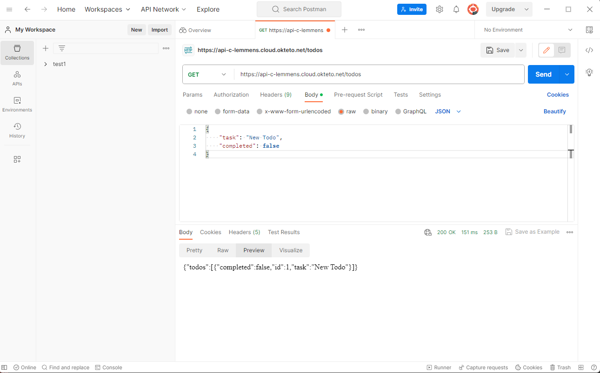
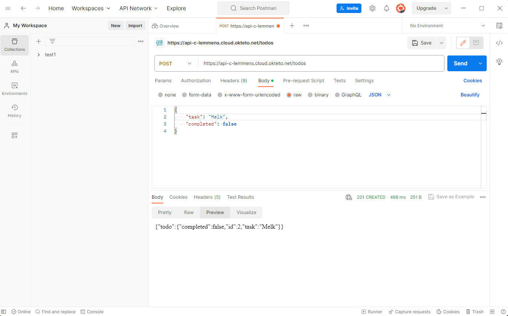
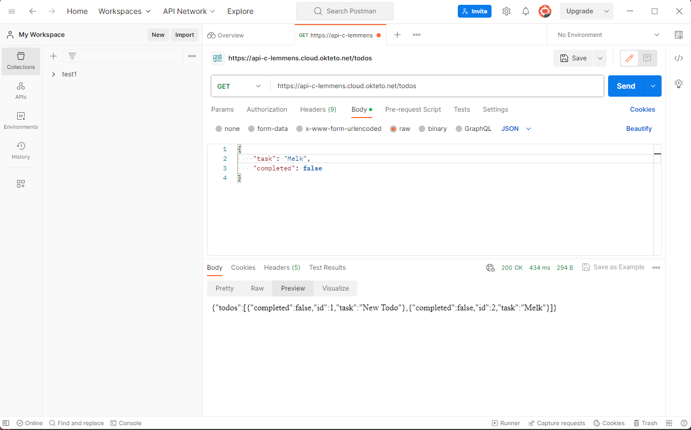
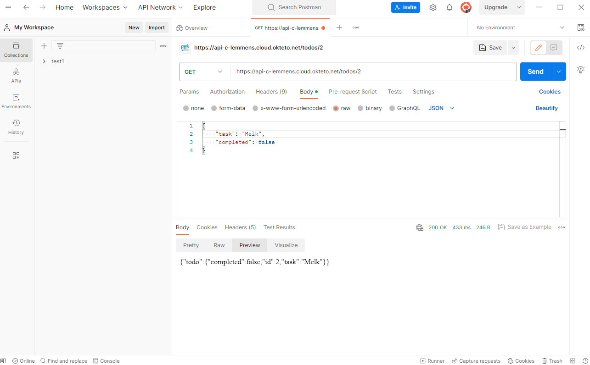
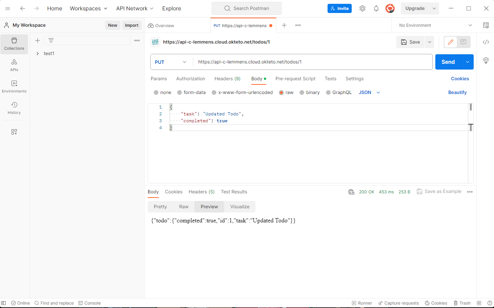
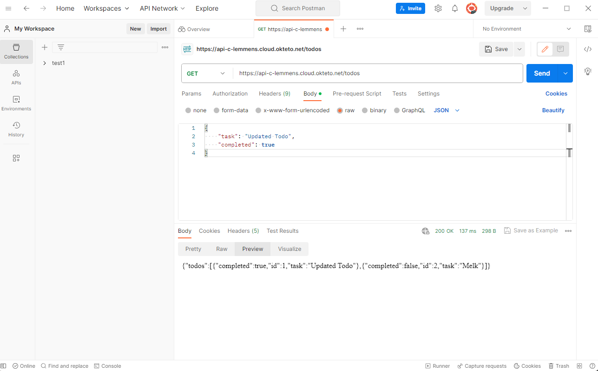
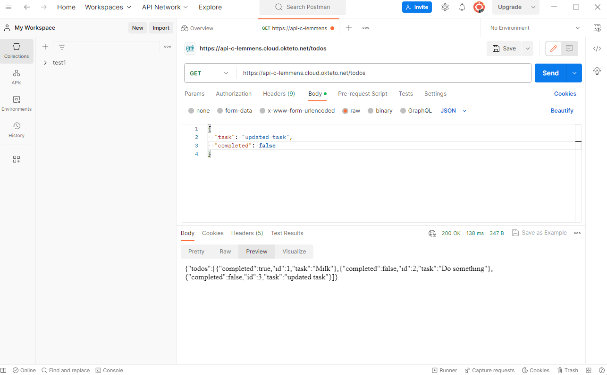
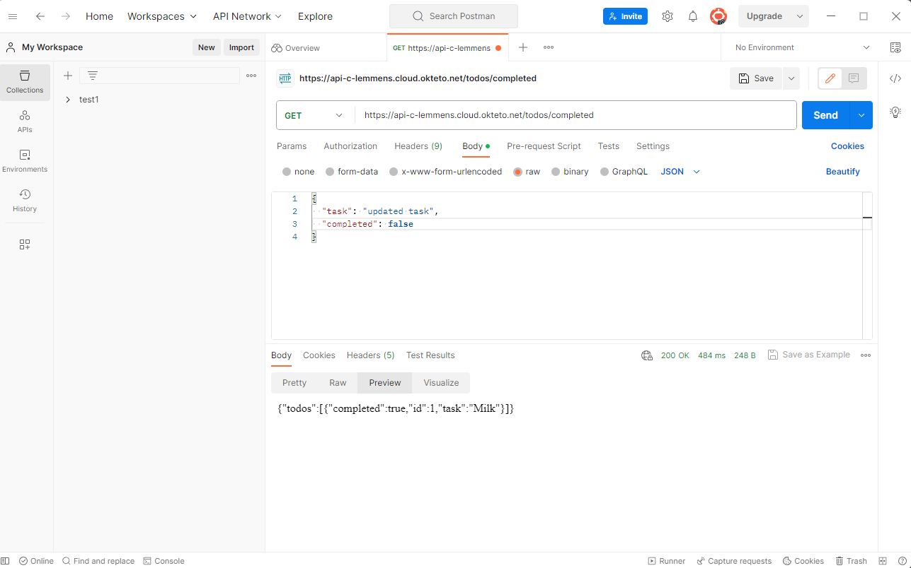
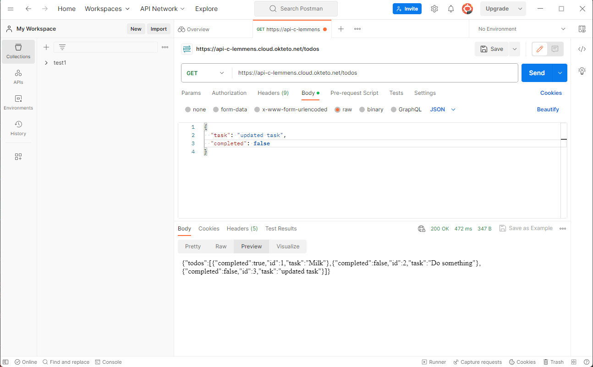
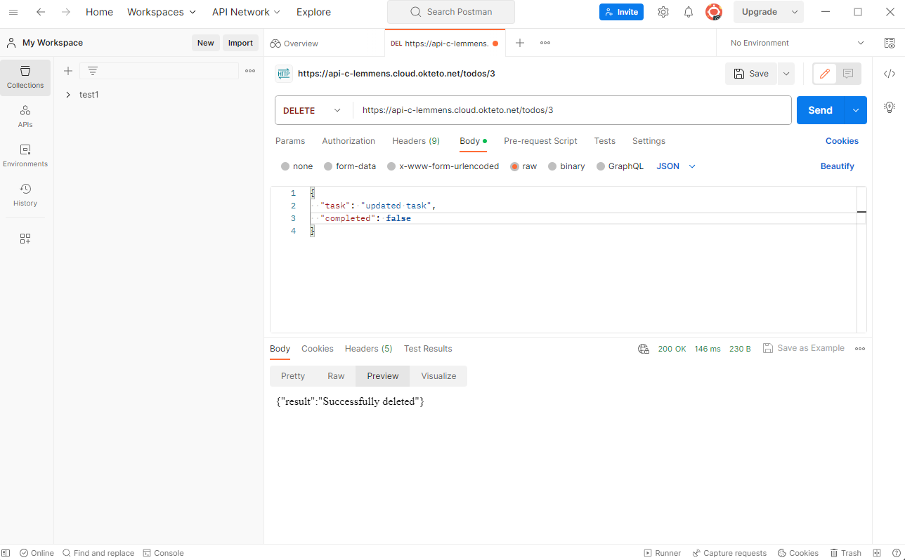

# API_Project Beschrijving van het gekozen thema, je API(s) en je uitbreidingen + link naar de zaken die hosted zijn op GitHub README.md

The project is a simple to-do list.
You can show the items on the to-do list, add new items, show specific items through the automatically added id and change/delete the items with the id.
furthermore you can create users and login

hosted Front-end: https://api-project-cl.netlify.app
hosted API:https://api-c-lemmens.cloud.okteto.net/todos

get:

post:

get after post:

get using id:

register user (post):

update todo list item 1:

completed items get: 

delete item:

completed:
1. ❔ ALGEMENE EISEN & DOCUMENTATIE (alles samen +50%)
Minstens 3 GET, 1 POST, 1 PUT en 1 DELETE endpoints
Minstens 3 entiteiten in je API via een SQLite databank
Minstens hashing en OAuth implementeren
Beschrijving van het gekozen thema, je API(s) en je uitbreidingen + link naar de zaken die hosted zijn op GitHub README.md
Aantoonbare werking totale API door screenshots van Postman requests op GitHub README.md
Logisch gebruik van path parameters, query parameters en body
Docker container voor de API(s), welke automatisch door GitHub Actions opgebouwd wordt
Deployment van de API container(s) op Okteto Cloud via Docker Compose

2.1 (+10%) Test alle GET endpoints van een van je APIs via de Requests en pytest library.
2.1.1 (+10%) Test alle niet-GET endpoints.

3.1 (+15%) Maak een front-end voor je applicatie die al je GET endpoints en POST endpoints bevat.
3.1.1 (+10%) Host de front-end op Netlify. 
3.1.2 (+10%) Geef de front-end een leuke stijlgeving.